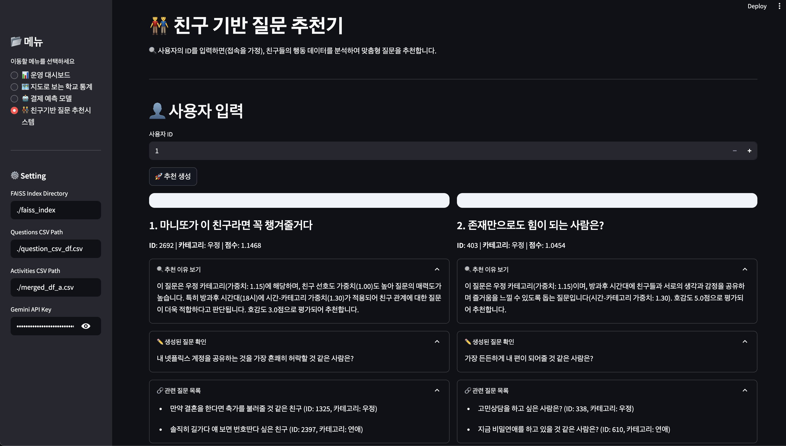
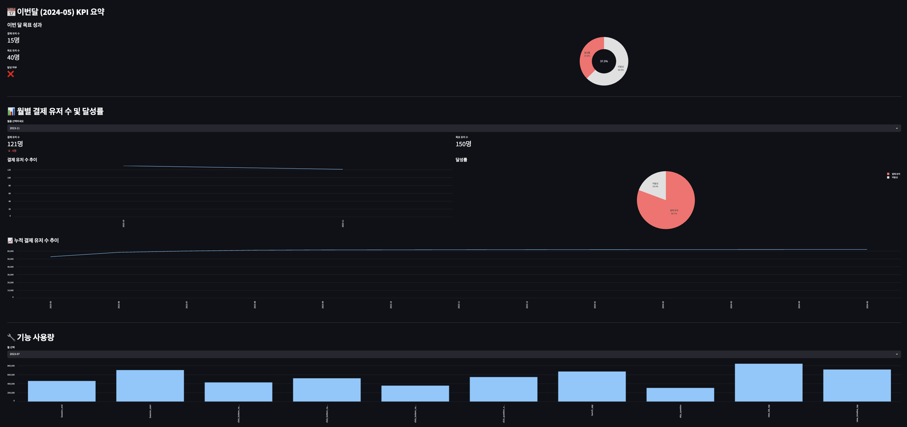

# 🧠 전환을 설계하다: 익명 투표 10대 SNS의 데이터 기반 결제 전략

> **Z세대 대상 SNS의 낮은 결제 전환 문제 해결을 위한 데이터 기반 전략 설계 프로젝트**

---

## ✅ 프로젝트 개요

- **목표**: Z세대 대상 익명 질문 SNS에서 사용자 이탈과 낮은 결제 전환 문제를 해결하기 위해  
  **퍼널 분석 → 행동 기반 가설 수립 → 개인화 추천 시스템 설계**까지 수행
- **기간**: 2025.03 ~ 2024.05
- **형태**: 3인 팀 프로젝트 (기업 데이터 프로젝트)
- **데이터기간**: 2023년도

---

## 👥 팀 구성 및 역할

| 이름   | 역할                                                                | GitHub                                          |
| ------ | ------------------------------------------------------------------- | ----------------------------------------------- |
| 박준혁 | 퍼널 분석, 호감도 분석, 추천 시스템 설계 및 구현, 발표              | [junhyeok0703](https://github.com/junhyeok0703) |
| 이은지 | EDA, XGBoost 및 Transformer 기반 결제 예측 모델링, 대시보드 UI 설계 | -                                               |
| 박세종 | 학교 좌표 기반 지도 시각화, 지역 확산 전략, 데이터 전처리 지원      | -                                               |

---

## 📁 프로젝트 산출물

| 항목                  | 링크                                                                                       |
| --------------------- | ------------------------------------------------------------------------------------------ |
| 🔗 추천 시스템 GitHub | [friend-question-recommender](https://github.com/junhyeok0703/friend-question-recommender) |
| 📄 분석 보고서        | [`10SNS분석_보고서.pdf`](./10SNS분석_보고서.pdf)                                           |
| 📄 발표 자료          | [`10SNS분석_발표자료.pdf`](./10SNS분석_발표자료.pdf)                                       |

---

## ✅ STAR 기반 프로젝트 설명

### ✅ 상황

- 2023년 5월, DAU 37만 명 → 7월 3만 명으로 급감한 10대 대상 SNS 앱
- 초성 확인 기능이 주요 수익 수단이나, 결제 전환율은 1% 미만
- 커뮤니티 중심 기능(view_lab)의 활성화로 서비스 정체성 및 수익성 악화

---

### ✅ 과제

**초성 확인 기능을 중심으로 결제를 유도할 전략을 데이터 기반으로 설계하자**

1. `질문 열람 → 상점 방문 → 결제` 전환 퍼널의 이탈 구간 분석
2. 초성 확인을 유도하는 질문 특성을 분석해 추천 시스템 전략 설계

---

### ✅ 실행

#### 1. 퍼널 분석

- 세션 로그 기반 사용자 흐름 정의  
  `질문탭 클릭 → 질문 열람 → 상점 방문 → 하트 상품 클릭 → 결제 완료`
- `질문 열람 → 상점 방문` 전환율 6.8% → 가장 많은 이탈 구간
- 질문 ID와 상점 방문 연결이 불가능하여 **초성 확인 유저 중심 분석**으로 전환

#### 2. 가설 수립 및 검증

> “호감도 높은 질문을 받은 유저가 초성 확인을 더 많이 한다”

- ChatGPT API로 3,000개 질문에 감정/매력/로맨틱 기준의 **호감도 점수(1~5점) 라벨링**
- 초성 확인 유저가 받은 질문의 평균 호감도 점수는 **0.3점 더 높고**,  
  **p-value = 0.003** → 통계적으로 유의미함 입증

#### 3. 추천 시스템 설계

- `질문 가치 점수 = 초성 확인 수 × 포인트 사용 × 호감도`
- “**본인이 궁금한 게 아니라 친구가 궁금할 질문을 추천하자**”는 전략 설정
- Gemini API로 질문을 6개 카테고리로 분류 후,
  - 카테고리별 전환율,
  - 시간대별 반응성,
  - 친구 기반 선호도를 종합해 점수 계산

#### 4. 추천 로직

```python
최종 점수 = base_score × (카테고리 가중치 × 시간대 가중치 × 친구 반응 가중치)
```

##### ✅ 추천 로직 개선 사항

- **연애 카테고리 편중 문제**  
  → 카테고리당 최대 3개로 제한하여 **콘텐츠 다양성 보장**

- **친구 반응 가중치 미반영 문제**  
  → `score` 값을 **정규화**하고, **가중치를 곱셈 → 덧셈 구조**로 전환하여 반영도 개선

- **확장성 고려**  
  → 향후 **실시간 배치/스트리밍 파이프라인 연동 가능한 구조**로 설계

---

### ✅ 결과

| 성과 항목 | 내용                                                    |
| --------- | ------------------------------------------------------- |
| 문제 정의 | 퍼널 흐름을 직접 정의하고, 이탈 지점을 식별             |
| 가설 검증 | AI 라벨링 + 통계 검증 조합으로 초성 확인 행동 요인 입증 |
| 전략 도출 | 감정/시간/친구 기반 정교한 추천 로직 설계               |
| 실무화    | 콘텐츠 다양성과 실시간 연동 구조를 고려한 시스템 설계   |

---

### 📸 시각 자료

#### 🧭 추천 시스템



#### 📊 운영 대시보드



> Streamlit 기반 대시보드로 운영자/기획자가 실시간 통계 확인 및  
> 유저별 추천 결과를 바로 추출할 수 있도록 구성

---

### 🧠 회고 및 성장

#### ✅ 잘한 점

- 로그의 제약을 **간접 가설로 해결**하여 현실적인 분석 전략 수립
- 단순 점수화가 아닌 **감정, 시간, 친구 선호도**까지 고려한 로직 설계
- 추천 로직 설계 시 **UX 다양성과 콘텐츠 피로도**까지 반영

#### 🧠 아쉬운 점

- **실시간 서비스에 적용 불가**로 A/B 테스트 통한 성과 측정은 어려움
- **사용자 피드백 기반 개선 루프 부재**

#### 🚀 다음에 적용할 것

- 설계 초기부터 **실시간 파이프라인 + 피드백 루프 설계**
- **정성 데이터(감정 등)의 정량화 + 통계 검정 조합** 지속 활용
- **UX 기반 추천 전략** (다양성 보장, 반복 노출 방지, 피로도 고려) 내재화

---

> **"유저의 감정을 데이터로 읽고, 전환을 설계한다."**  
> 이 프로젝트는 분석을 넘어, **전략적 사고와 실무형 시스템 설계 역량**을 키운 값진 경험이었습니다.
